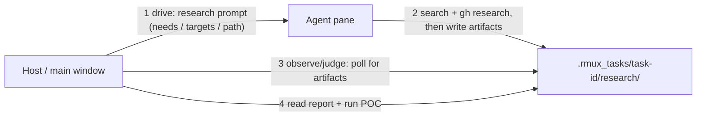
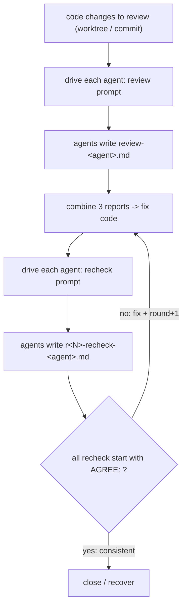

# win-rmux：一个执行单元里的多 agent 远程驱动

## 环境约束（全程）

- **仅使用 pwsh（PowerShell 7）**：所有命令、脚本、hook、wt 内启动一律用 `pwsh`；
  **禁用 `powershell.exe`（5.1）与 cmd**。rmux 会话默认 shell 设为
  `C:\Program Files\PowerShell\7\pwsh.exe`（见 `references/options.md`）。

核心模型：

- **执行单元（Execution Unit）** = 一个 rmux 会话，承载 N 个 agent 各占一个 pane；默认 3 个 codex/kimi/claude，上 2 下 1。
- **两种模式**：`Visible=$true`（默认，前台弹 wt 可见）；`Visible=$false`（后台 headless 纯 rmux 驱动）。
- **六原语**：launch / locate / drive / observe / judge / recover-close。
- 寻址按 agent 名，不硬编码 pane 索引；未来加 pi/grok 只改 `$agents`。

## Quick start（端到端最小路径）

```powershell
# 1. 跑前置守卫（见下，含 refresh-user-env 与 hook 安装；关键：让 agent 有 API key）
# 2. launch：弹 wt 建执行单元（三 agent 上 2 下 1）
# 3. locate：rmux list-panes -t $unit -F '#{window_index}.#{pane_index} #{pane_current_command}'
# 4. drive：给目标 agent 发提示（两段式：文本 -l -> Enter -> capture 验证提交，见 drive）
# 5. observe/judge：轮询产物文件或 AGENT_STATE_<name> 判 idle
# 6. 收尾：kill-session -t $unit（默认 scoped 关闭；勿随手 kill-server）
```

> 想跳过注册表/逐原语读完全文，先从上面 6 步跑通最小场景；详细步骤见各原语小节。

## Agent 注册表（当前 3，可扩展）

```powershell
$unit    = 'execution-unit'    # 执行单元名，**并行/多任务时请改成唯一名**（如 'res'/'review' 或按 task-id）；同名会话会被 launcher 复用/冲突
$Visible = $true     # 前台；$false = 后台

$agents = @(
  @{ name = 'codex';  cmd = 'codex';  args = @('--dangerously-bypass-approvals-and-sandbox', '--dangerously-bypass-hook-trust', '--no-alt-screen') }
  @{ name = 'kimi';   cmd = 'kimi';   args = @('--auto') }
  @{ name = 'claude'; cmd = 'claude'; args = @('--dangerously-skip-permissions') }
  # 未来：@{ name='pi'; cmd='pi'; args=@(...) }、@{ name='grok'; cmd='grok'; args=@(...) }
)
```

默认 pane 映射（按注册表顺序，都在 window 0）：`0.0=codex`、`0.1=kimi`、`0.2=claude`。

## 前置守卫（每次先跑）

```powershell
# 指定本 skill 安装目录（脚本内联执行时 $PSScriptRoot 为空，必须显式给出）。
# 例：C:\Users\<user>\.claude\skills\win-rmux（Claude）、~\.codex\skills\win-rmux（Codex）、
#     ~\.config\agents\skills\win-rmux（kimi-cli，gh skill）等。请替换为你的实际安装路径。
$SkillDir = '<SKILL_INSTALL_DIR>'   # 必填：用本机安装路径替换此占位符
$env:RMUX_DISABLE_TINY_CLI = '1'   # 探针/操作统一走 full helper，规避 tiny CLI 误报（防止空报误触发 kill-server）
if (Get-Process rmux -ErrorAction SilentlyContinue) {
  # 污染 daemon 守卫：仅在「rmux 进程在且 list-sessions 明确成功返回空」时 kill-server。
  # 若 list-sessions 查询失败（exit 非 0，daemon 可能刚启动/不可用）则**不 kill**，避免误杀正在用的 daemon。
  $s = rmux list-sessions 2>$null; $rc = $LASTEXITCODE
  if ($rc -eq 0) { $has = $s -match '\S' } else { $has = $true }   # 查询成功且无任何会话 = 真无进程
  if (-not $has) { rmux kill-server }
}
Remove-Item Env:NO_COLOR -ErrorAction SilentlyContinue
$env:TERM = 'xterm-256color'; $env:COLORTERM = 'truecolor'
# PATH 以 Machine+User 为准（去宿主污染），进程独有条目（本会话新装/临时加的）追加保留不丢弃
$mu = [Environment]::GetEnvironmentVariable('Path','Machine') + ';' + [Environment]::GetEnvironmentVariable('Path','User')
$env:Path = (($mu -split ';') + ($env:Path -split ';') | Where-Object { $_ } | Select-Object -Unique) -join ';'
# User 环境变量同步（宿主常不加载 User env，agent 会缺 DEEPSEEK_API_KEY 等 API key；
# 必须 dot-source，子进程调用无效）
# [风险] 该脚本会把 **全部** User 作用域变量（含其中存储的所有密钥/凭据）拷贝进本会话，进而被下方
#   免审批/免沙箱 agent 读到。若计划对不可信输入跑 research，建议改成只放行 agent 实际需要的 key
#   （如 DEEPSEEK_API_KEY / ANTHROPIC_API_KEY / GITHUB_TOKEN）。allowlist 参考实现见该项目研究产物的
#   `.rmux_tasks/skill-review/research/poc-claude/hardened-guard.ps1`（非随 skill 分发，可在各自项目里自建）。
. "$SkillDir/scripts/refresh-user-env.ps1"
# agent 状态 hook 检测/安装（幂等 + 路径感知）。[风险] 首次运行会**改写全局** agent 配置
# （~/.codex/hooks.json & config.toml、~/.claude/settings.json、~/.kimi-code/config.toml），影响以后
# 所有会话（每个 codex/kimi/claude 事件都会起一次 pwsh 上报状态）。回滚：restore 安装器旁边生成的
# `*.bak-<时间戳>`，或删掉其中的 win-rmux hook 项；不需要可注释本行：judge 回退到进程/capture 判活。
pwsh -NoProfile -File "$SkillDir/scripts/install-agent-hooks.ps1"
```

> `$PSScriptRoot` 仅在 `.ps1` 文件内定义；守卫作为「粘贴运行」片段在交互 pwsh 执行时其为空，
> 必须改用显式 `$SkillDir`（2026-08-21 三 agent review 一致指出）。

hook 状态通道见 `references/hooks.md`；安装后 agent 会在 `working/blocked/idle` 变化时回写
`AGENT_STATE_<name>`，`judge` 用 `show-environment` 读取。

## launch：建执行单元

> **默认从 wt 窗口内启动 daemon**（2026-08-21 修正）。CI/agent 宿主常把命令包进 job object，
> 会阻止独立 rmux daemon（`new-session -d` 报 `os error 5`）；wt 是 UWP，进程树脱离 job，
> 把整套 launch 放进 wt 内执行即稳定。launcher **不要**含 `attach-session`（否则 wt 卡前台），
> 建好后宿主 `locate` 复核，`Visible` 时单独 recover 弹 attach。

### 环境探针（launch 第一步，必做）

> **不得在历史/已有会话上叠窗格**。多任务并存时，若每次都往同一个会话 `split-window`，会堆出
> 多批 agent 窗格+进程残留（实测：一个会话堆到 9 窗格、4 个 kimi + 4 个 claude + 1 个 codex 并存）。
> launch 前必须先探针：

```powershell
# 0. 环境探针：daemon 是否在跑、有哪些已有会话 - 只读，不改动任何会话
rmux list-sessions -F '#{session_name}'              # 当前所有会话
# 若有 rmux 进程但 list-sessions 为空 -> daemon 在但无任务，可直接建新会话

# 1. 本任务会话名必须「独立唯一」，用 task-id 命名（见 task-workflows 命名规范）：
#    $unit = "rs-$(Get-Date -Format yyyyMMdd)-<topic>"   # 或 rv-...（评审）
#    绝不复用固定名（execution-unit / research 等）

# 2. 撞名处理：目标 $unit 已存在 -> 询问清理还是中止，绝不静默 kill、绝不追加窗格
if (@(rmux list-sessions -F '#{session_name}' 2>$null | Where-Object { $_ }) -contains $unit) {
  $c = Read-Host "会话 [$unit] 已存在（可能是历史任务残留）。[a]中止 [c]清理后重建"
  if ($c -notin @('c','C')) { "已中止，未触碰 [$unit]"; exit }
  rmux kill-session -t $unit
}
```

- **每个任务 = 一个新会话**（唯一 task-id 命名），任务结束用 `kill-session -t $unit` scoped 关闭；
  不要跨任务无限叠加窗格。
- 清理他人/历史会话**必须显式指出会话名**再 `kill-session -t <名>`；从不用无参 `kill-server`
  （会误杀其它任务的会话）。
- launcher 已把上述探针内置（见 `references/rmux-usage.md`）；此处是规范说明。

最简示意（完整 launcher 脚本见 `references/rmux-usage.md`）：

```powershell
# 1. 弹 wt（宿主在 job object 内必须走这步）跑 launcher：new-session + split-window -h + split-window -f -v
Start-Process (Get-Command wt.exe).Source -ArgumentList "-w new --title `"$unit-launch`" -d `"$wd`" pwsh -NoProfile -File `"<launcher.ps1绝对路径>`" -unit `"$unit`"" -WindowStyle Minimized
Start-Sleep -Seconds 10
rmux list-panes -t $unit -F "#{window_index}.#{pane_index} #{pane_id} cmd=#{pane_current_command}"   # locate 复核
# 2. 布局：3 = 上 2 下 1；2 = -h 左右；1 = 单 pane；>3 前两个上排、其余 -f -v 全宽下堆
```

- `$wd`（宿主侧）与 launcher 内的 `$wd` 是两份独立副本；两处都要给 `(Get-Location).Path`。
- 宿主不在 job object 内（普通交互终端）时，可直接宿主 pwsh 跑 launcher body（更轻），失败
  报 `os error 5` 则回退 wt 启动。
- launcher body 只含环境守卫（PATH/NO_COLOR/TERM），**用户 env 同步与 hook 安装仍要先跑一次
  前置守卫**（否则 agent 缺 API key、judge 无 hook 状态）。
- **守卫与 launch 必须在「同一个 pwsh 进程」内连续执行**：`refresh-user-env` 是
  `dot-source` 注入**当前进程**环境，进程一退出就失效；`Start-Process wt` 继承的是**当前
  进程的环境**。若把守卫和 launch 拆成两个独立进程（如两个 bash 调用），refresh 的结果会丢失，
  wt -> launcher -> codex 全链缺 `DEEPSEEK_API_KEY` 等 key。要么同一脚本里先 `. refresh-user-env`
  再 `Start-Process wt`，要么把 `. refresh-user-env` 放进 launcher 脚本（见 rmux-usage.md）。

## locate：agent <-> pane 映射

```powershell
rmux list-panes -t $unit -F "#{window_index}.#{pane_index} #{pane_id} cmd=#{pane_current_command} top=#{pane_top} left=#{pane_left} w=#{pane_width} h=#{pane_height}"
# 或：rmux find-panes --current-command codex
```

## drive：给指定 agent 发 prompt（严格流程）

> **必守**：drive 不是「发完就走」，必须做「提交确认」：发文本后**必须**验证它已真正进入
> agent 处理（否则 prompt 停在输入框，agent 没开始）。三 agent 均实测：文本+Enter 同发会被吞。
> 完整四步严格流程 + 出错排查见 `references/troubleshooting.md`（drive 相关坑的速查）。

```powershell
function Get-AgentPane([string]$name) {
  $i = [array]::IndexOf($agents.name, $name)
  if ($i -lt 0) { throw "unknown agent: $name" }
  "${unit}:0.$i"
}
$p = Get-AgentPane 'codex'
# [1] 目标 pane 校验：用 pane_pid 反查**真实进程名**（display-message '#{pane_current_command}' 对 TUI agent 不可靠，
#    可能把 kimi 标成 codex；见 references/troubleshooting.md「二、drive 相关」）；不匹配即 **throw 中止发送**。
#    注：假设 agent 是 pane 的直接进程；若经 pwsh/cli 包装启动，需再向下解析子进程 PID。
$pp = rmux display-message -p -t $p -F '#{pane_pid}' 2>$null
$real = (Get-CimInstance Win32_Process -Filter "ProcessId=$pp" -ErrorAction SilentlyContinue).Name
if ($real -notmatch 'codex') {
  throw "target pane ${p} real process=$real 非 codex；先 locate 复核 pane<->agent 映射，禁止盲发（warn-and-continue 会把 prompt 发给错误 agent）"
}
# [2] 发文本（-l 字面量防截断）-> [3] 单独 Enter 提交 -> [4] capture 验证 prompt 已离开输入框：
rmux send-keys -t $p --wait quiet --stable-for 800ms --timeout 15s -l -- '<ascii-prompt>'
rmux send-keys -t $p -- Enter
rmux capture-pane -t $p -p   # 若见 `up to edit queued` / prompt 仍在输入框 -> Enter 被吞，单独重发 Enter
```

- 回车只有 `Enter`；`C-m` 是字面量 `^M`。**Enter 必须单独一次 send-keys 发**（与文本同发实测不提交）。
- **严禁对 codex pane 发 `C-c`**：codex（`--no-alt-screen`）把单次 `C-c` 解释为「退出应用」，进程与 pane 会整个消失
  （kimi/claude 则容忍 `C-c`）。drive 前**不要**用 `C-c` 预清 codex 输入框；队列需要清时也只对 kimi/claude 用。详见
  `references/troubleshooting.md`「send-keys / 输入」。
- 中文乱码：prompt 用 ASCII（通篇英文），含空格用 `-l` 字面量或拆 token + `Space`。
- 等待：`--wait quiet|--wait-text|--wait-next-text|--wait-visible-text|--wait-pane-exit` + `--stable-for` + `--timeout`。
- **`--wait quiet` 超时 != 未发送**（指令可能已入输入框待提交）：**此时严禁重发同一条 prompt**
  （会排队两次执行两遍）；按上面 capture 验证只补 Enter，若已排队多份先 `C-c` 清队列。详见
  `references/troubleshooting.md`。

## observe：读 agent 输出

```powershell
rmux capture-pane -t $p -p        # codex(--no-alt-screen) 或非 TUI 可读
rmux stream-pane -t $p --lines    # 流式；持续阻塞输出（实测不自行退出），勿前台裸跑：配超时或放后台/job
rmux pane-snapshot -t $p          # 快照
```

### TUI 备屏的文件产物获取（claude/kimi 等备屏 TUI）

claude/kimi 走 alternate screen，`capture-pane -a`/`-H`/`pane-snapshot` 均返回
空（实测 `no alternate screen`），终端的 scrollback 历史也无法从外部回读；长回复、
review 结论等**超过一屏的产物会永久丢**。可靠做法是让 agent 把结论**写进文件**再读文件
（2026-08-21 三 agent review 实测）：

```powershell
# 1. 指示 agent 把产物写到工作区某个路径（prompt 用 ASCII；文件用绝对路径）
$targetName = 'kimi'   # 目标 agent 名（须与 $p 对应；下面诊断按它读 AGENT_STATE_<name>）
$writePrompt = 'Write your full review to D:\win-rmux\.rmux_tasks\<task-id>\review\review-kimi.md (markdown). Set-Content -Path D:\win-rmux\.rmux_tasks\<task-id>\review\review-kimi.md -Value (content). Reply "WRITTEN" when done.'
rmux send-keys -t $p --wait quiet --stable-for 800ms --timeout 15s -l -- $writePrompt
rmux send-keys -t $p -- Enter
# 2. 轮询文件出现（judge 状态回 idle 或文件存在）；加超时上限防永久挂起
$deadline = (Get-Date).AddMinutes(3)
while (-not (Test-Path 'D:\win-rmux\.rmux_tasks\<task-id>\review\review-kimi.md') -and (Get-Date) -lt $deadline) { Start-Sleep -Seconds 15 }
if (-not (Test-Path 'D:\win-rmux\.rmux_tasks\<task-id>\review\review-kimi.md')) {
  Write-Warning "文件超时未出现：capture=$((rmux capture-pane -t $p -p 2>$null) -join ' ') state=$(rmux show-environment -t $unit "AGENT_STATE_$targetName" 2>$null)"
}
# 3. 直接读文件内容（不经 rmux，产物完整持久）
```

- agent 写入用 `Set-Content`（pwsh，符合环境约束）；写错时目录要先 `New-Item -ItemType Directory -Force`。
- 备屏 TUI 的当前帧 capture 仍可读到少量尾部（判定完成用 hook 状态 `idle` 或文件存在，更稳）。
- 发送指令时若 pane 仍 `working`，`--wait quiet` 会超时（send-keys 报 timed out）；
  **超时 != 未发送**，处置见上文「drive：给指定 agent 发 prompt（严格流程）」步骤 [4]：先查
  queued messages，不要盲目补发（补发可能造成重复排队执行两遍）。

## judge：判断 agent 状态 / 是否已提交

首选读 hook 上报状态（需一次性安装 hook，见 `references/hooks.md`）：

```powershell
rmux show-environment -t $unit AGENT_STATE_codex   # idle | working | blocked（空=未上报）
```

回退（未装 hook 或旧 agent）：

- 就绪：`RMUX_DISABLE_TINY_CLI=1` + `list-panes` 确认 pane 在 + `Get-Process <cmd>` 进程活。
- 可 capture（如 codex `--no-alt-screen`）：`capture-pane -p` 看预期输出。
- TUI 备屏（claude/kimi）：优先看尾部状态（见 `references/troubleshooting.md`「TUI 备屏 / 判活」busy/ready 二值），再可辅以进程
  CPU 增长判提交；**注意 CPU 法对 claude 深度思考阶段不可靠**（统计的是累计 CPU，深度思考
  常驻低增量，会误报「未提交」-> 触发重发 -> 重复排队），只作辅助：

```powershell
$before = ((Get-Process claude -ErrorAction SilentlyContinue) | Measure-Object CPU -Sum).Sum
# 同样走两段式：先文本(-l)再单独 Enter，与 drive 规则一致
rmux send-keys -t (Get-AgentPane 'claude') -l -- 'prompt'
rmux send-keys -t (Get-AgentPane 'claude') -- Enter
Start-Sleep -Seconds 2
$after = ((Get-Process claude -ErrorAction SilentlyContinue) | Measure-Object CPU -Sum).Sum
# 注：多 instance 时 CPU 是数组，必须 -Sum 聚合成标量再做 -gt 比较（2026-08-21 研究 review 指出）
if ($after - $before -gt 0.5) { 'submitted' }
```

- claude/kimi 的 capture 为空是 alternate screen 正常现象，不是错误。

## recover / close

```powershell
# recover：前台重新弹 wt attach（关 wt 只是 detach，daemon/会话仍在）
$wd = (Get-Location).Path          # recover 常在同一会话继续，$wd 可能未定义；显式补上
$wtArgs = "-w new --title `"$unit`" -d `"$wd`" pwsh -NoProfile -Command `"rmux attach-session -d -t $unit`""
Start-Process -FilePath (Get-Command wt.exe).Source -ArgumentList $wtArgs -WindowStyle Minimized
# 不 new-session -A、不 kill-server

# close：默认只关**本执行单元**（scoped），不要顺手杀 daemon 上别人/其它任务的会话
rmux kill-session -t $unit     # 关执行单元（推荐默认；其它会话/daemon 保留）
# [风险] kill-server 是**最后手段**：它杀掉本机 daemon 上的**全部会话**（含用户其它工具 / 并行任务）。
#   仅当确认这台 host 的 rmux daemon 只属于本 skill 且无其它保留会话时才用；常驻开发用 kill-session 即可。
# rmux kill-server               # 全关（谨慎：会杀掉整台机器上所有 rmux 会话）
```

## 三 agent yolo / 去交互（--help + gh 源码已印证）

| agent | yolo 启动 | 运行中切换 | 免备屏 |
| --- | --- | --- | --- |
| codex | `--dangerously-bypass-approvals-and-sandbox --dangerously-bypass-hook-trust` | - | `--no-alt-screen` [是] |
| claude | `--dangerously-skip-permissions` | - | [否] |
| kimi | `--auto`（或 `-y`） | `/yolo on` | [否] |

- 首选启动即免交互；若仍阻塞：kimi 发 `/yolo on` + `Enter`；codex/claude 审批键通常 `y`/`n`。
- one-shot 非交互：`codex exec '<p>'` / `claude -p '<p>'` / `kimi -p '<p>'`（kimi `-p` 不能与 `-y` 组合）。

> [风险] **blast-radius 警告**：上表 yolo 参数全部禁用 agent 的**审批与沙箱**（`--dangerously-bypass-approvals-and-sandbox`、
> `--dangerously-skip-permissions` 等），agent 可直接执行命令/落盘/访问密钥。research/review 会把这些 agent 推向
> **不可信输入**（web/gh 搜索、第三方 prompt、他人 review 内容）。二者叠加 = prompt 注入即可在主机以你的身份执行任意操作。
> - 只对**你信任的输入**、在自己熟悉的工作区运行本 skill；从不驱动这些 pane 处理来源不可信的 web/gh 内容而不复查。
> - 产物（尤其 POC/脚本）先人工审查再执行；敏感任务建议在隔离环境里跑。
> - 这些 flag 是 skill 的**用法要点**，保留即可，但务必清楚上面的风险（2026-08-21 三 agent 研究 review 共识）。

## 任务原语（在六原语之上组合的两个工作流）

> 六原语（launch/locate/drive/observe/judge/recover-close）是单步原子操作；**任务原语**是
> 面向两类实际任务的标准工作流，复用六原语自动推进。详细实现、产物规范、循环条件见
> `references/task-workflows.md`。

### research：研究任务（产研究报告 + 最小原型 POC）

适用：根据需求做信息搜索、代码研究（含用 `gh` 搜 GitHub 代码），得出可用结论 + 最小可跑原型。



要点：
- 研究 prompt 明确：需求、要搜的关键词/仓库、是否用 `gh search`/`gh api`、产物写到哪。
- 产物二件套：研究报告（结论+依据+方案）+ 最小原型（可独立运行的 POC 代码），统一收在
  `.rmux_tasks/<task-id>/research/`（见 `references/task-workflows.md` 目录规范）。
- 完成后 `judge` 确认 agent 回 idle、读文件产物（不经 rmux，备屏完整）。

### review-cycle：评审->修改->复核循环（到一致才停）

适用：审阅一批代码改动，让多 agent 独立评审 -> 主窗口按报告改代码 -> 再复核 -> 直到三方一致无必改项。



要点：
- **不关闭执行单元**：循环全程保留单元，agent 会话/上下文不断，避免每轮重开；达成一致后才
  `close`（或 `recover`）。
- review 与 recheck 是两种产物：`review-<agent>.md`（首轮独立评审）、`r<N>-recheck-<agent>.md`
  （复核上轮修复，round 递增、旧产物保留归档），统一在 `.rmux_tasks/<task-id>/review|recheck/`。
- 循环退出条件：**三方 `recheck` 都以 `AGREE:` 开头**（= 无 must-fix）；设最大轮数防死循环。
- review prompt 需内置「跳过凭据/密钥文件」（见 troubleshooting「agent 行为」）；
- 长 prompt 避免 send-keys 截断：把完整指令写文件让 agent Read（见 troubleshooting「drive 相关」）。

## 关键踩坑

> **踩坑/排障统一维护在 `references/troubleshooting.md`**（现象 + 排查 + 处理速查表），本文不
> 承载坑内容。操作原语遇错时（launch 失败、drive 不提交、agent 卡住、备屏捕获空、send-keys
> 异常等）去那查，别在其它文档找。命令/格式/环境/键位/选项全量见 `references/README.md`。
